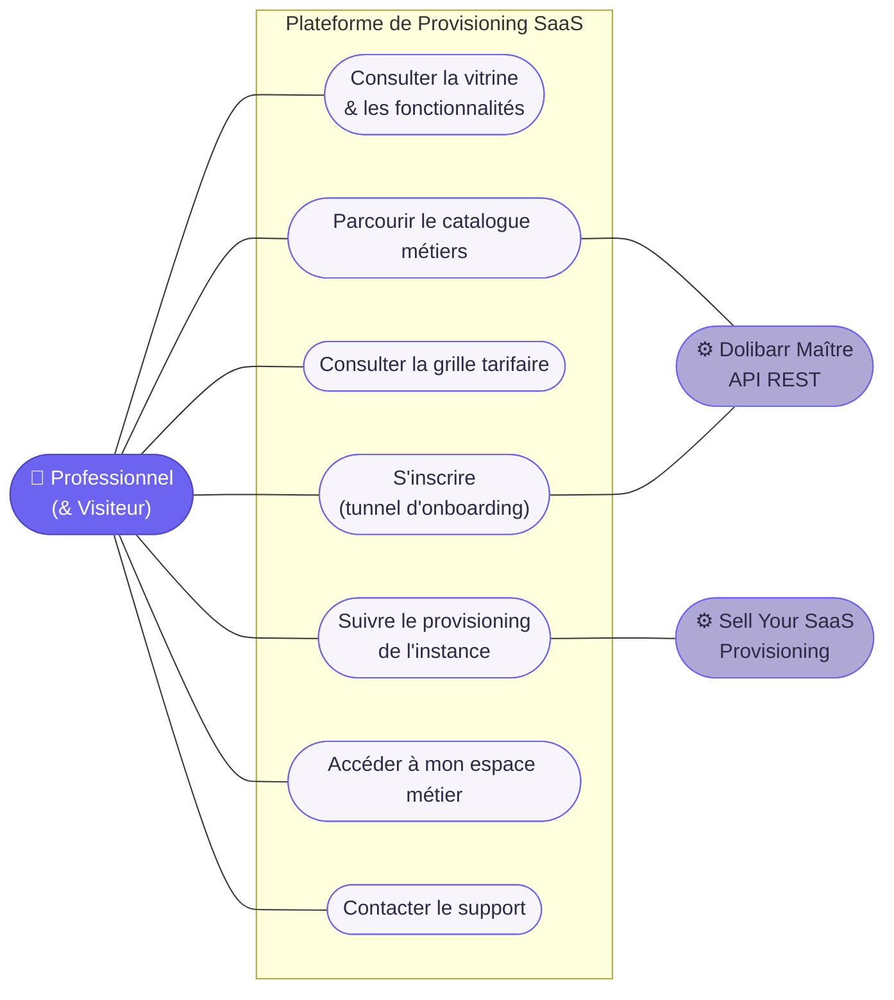
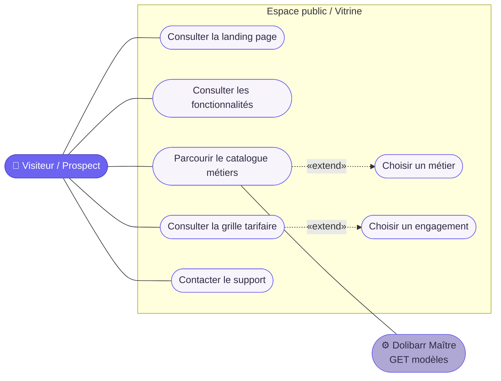
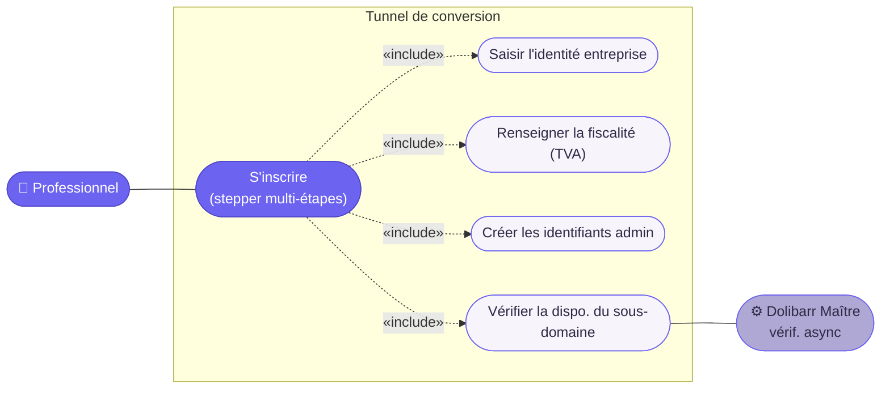
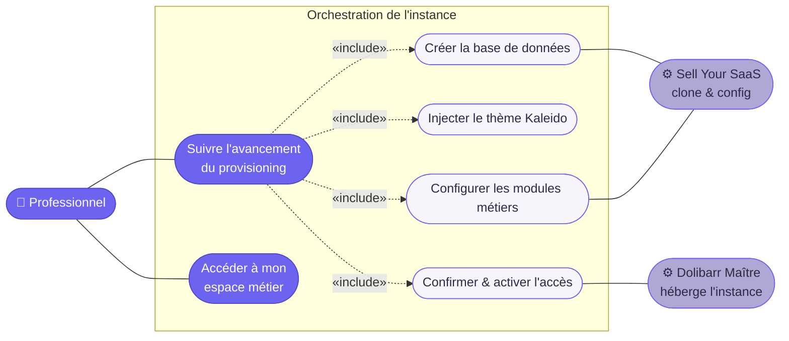

# Diagrammes de cas d'usage

> Documentation fonctionnelle — Plateforme de Provisioning SaaS pour Dolibarr (déclinaisons métiers)
> Agence Pichinov

Ce document décrit les acteurs et les cas d'usage de l'application. Les diagrammes sont écrits en [Mermaid](https://mermaid.js.org/) : ils se versionnent comme du texte et sont rendus nativement par GitHub, GitLab et la plupart des outils de documentation.

> **Note de notation.** Mermaid ne propose pas de diagramme de cas d'usage UML natif. On l'approxime avec des graphes orientés où les acteurs sont des nœuds rectangulaires `[Acteur]`, les cas d'usage des nœuds arrondis `(Cas d'usage)`, et les relations `«include»` / `«extend»` des flèches pointillées étiquetées.

---

## 1. Acteurs

| Acteur | Type | Rôle |
|--------|------|------|
| **Visiteur / Prospect** | Humain (non authentifié) | Découvre la vitrine, parcourt le catalogue et les tarifs. |
| **Professionnel** | Humain | Freelance, fleuriste, garagiste ou artisan qui souscrit et suit la création de son instance. |
| **Dolibarr Maître** | Système (API REST) | Fournit les modèles métiers (`GET`) et reçoit l'ordre d'instance (`POST`). |
| **Sell Your SaaS** | Système (module Dolibarr) | Clone l'instance, configure les modules, gère l'abonnement et la facturation. |

---

## 2. Vue d'ensemble du système

---

## 3. Découverte & Sélection — *Pages 1 à 4 & 7*

- **Choisir un métier** — 4 templates : Freelance · Fleuriste · Garagiste · Artisan.
- **Choisir un engagement** — 3 offres : Mensuel · Annuel · À vie.
- Le catalogue est généré dynamiquement à partir d'un appel `GET` vers le Dolibarr Maître.

---

## 4. Tunnel d'inscription — *Page 5 (onboarding multi-étapes)*

**Interactions dynamiques :** validation à la volée (RegEx e-mail, jauge de force du mot de passe), vérification asynchrone du sous-domaine (indicateur vert/rouge), skeleton loaders entre les étapes.

---

## 5. Provisioning & Accès — *Page 6 (tableau de bord)*

L'application interroge l'état d'avancement en arrière-plan (polling ou WebSocket). Les étapes passent de *En cours* à *Validé* (Création BDD → Injection du thème Kaleido → Configuration des modules métiers). À la confirmation finale, le bouton de chargement devient le CTA « Accéder à mon espace [Nom du Métier] ».

---

## 6. Récapitulatif des cas d'usage par acteur

### Visiteur / Prospect
- Consulter la vitrine & les fonctionnalités
- Parcourir le catalogue métiers
- Consulter la grille tarifaire
- Choisir un métier & un engagement
- Contacter le support

### Professionnel
- S'inscrire via le tunnel d'onboarding
- Vérifier la disponibilité du sous-domaine
- Suivre le provisioning de l'instance
- Accéder à son espace métier

### Dolibarr Maître *(système)*
- Fournir les modèles métiers (`GET`)
- Vérifier le sous-domaine (async)
- Recevoir l'ordre d'instance (`POST`)
- Héberger l'instance créée

### Sell Your SaaS *(système)*
- Cloner la base de données
- Injecter le thème Kaleido
- Configurer les modules métiers
- Gérer l'abonnement & la facturation

---

*4 acteurs · 7 pages · 18 cas d'usage couvrant la découverte, la conversion et le provisioning automatisé via Sell Your SaaS.*